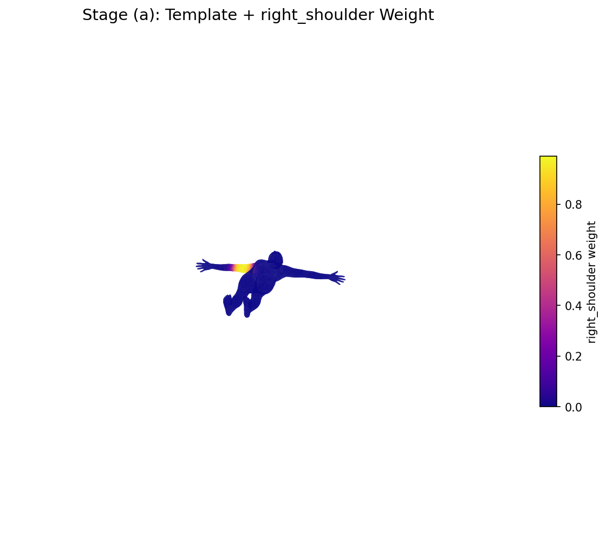
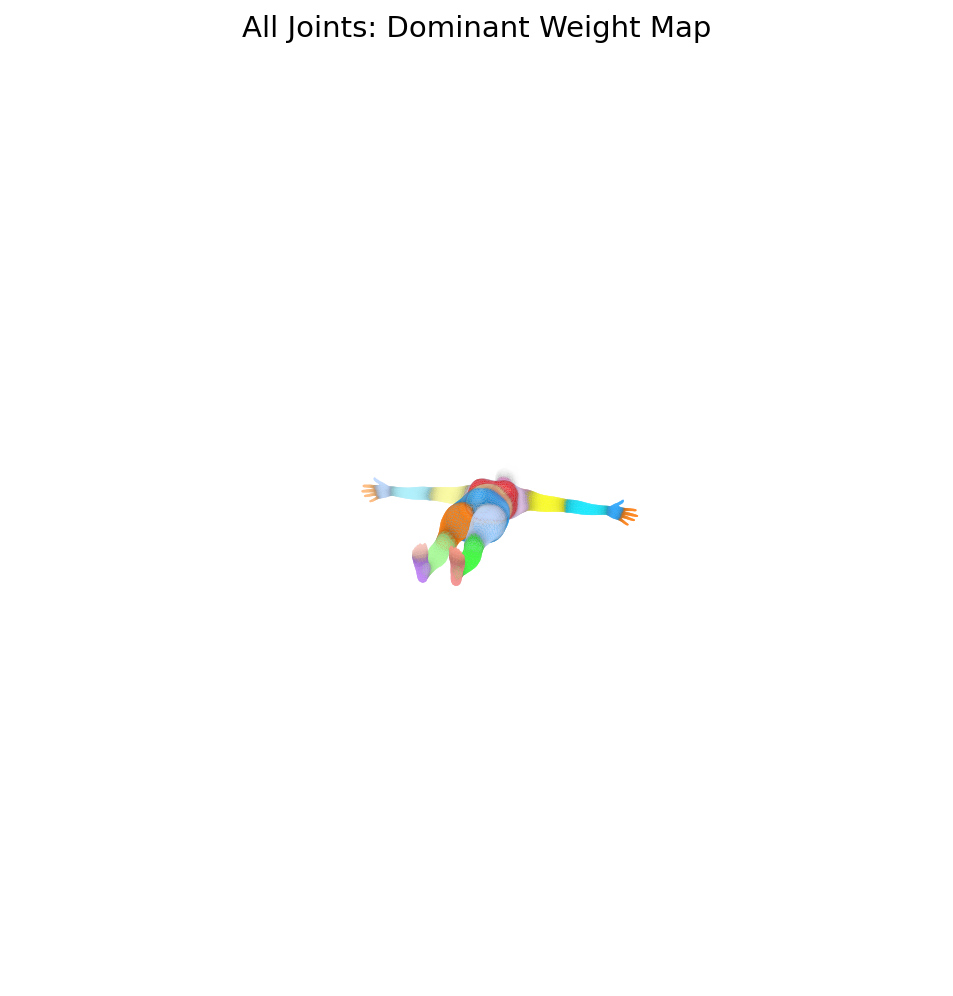
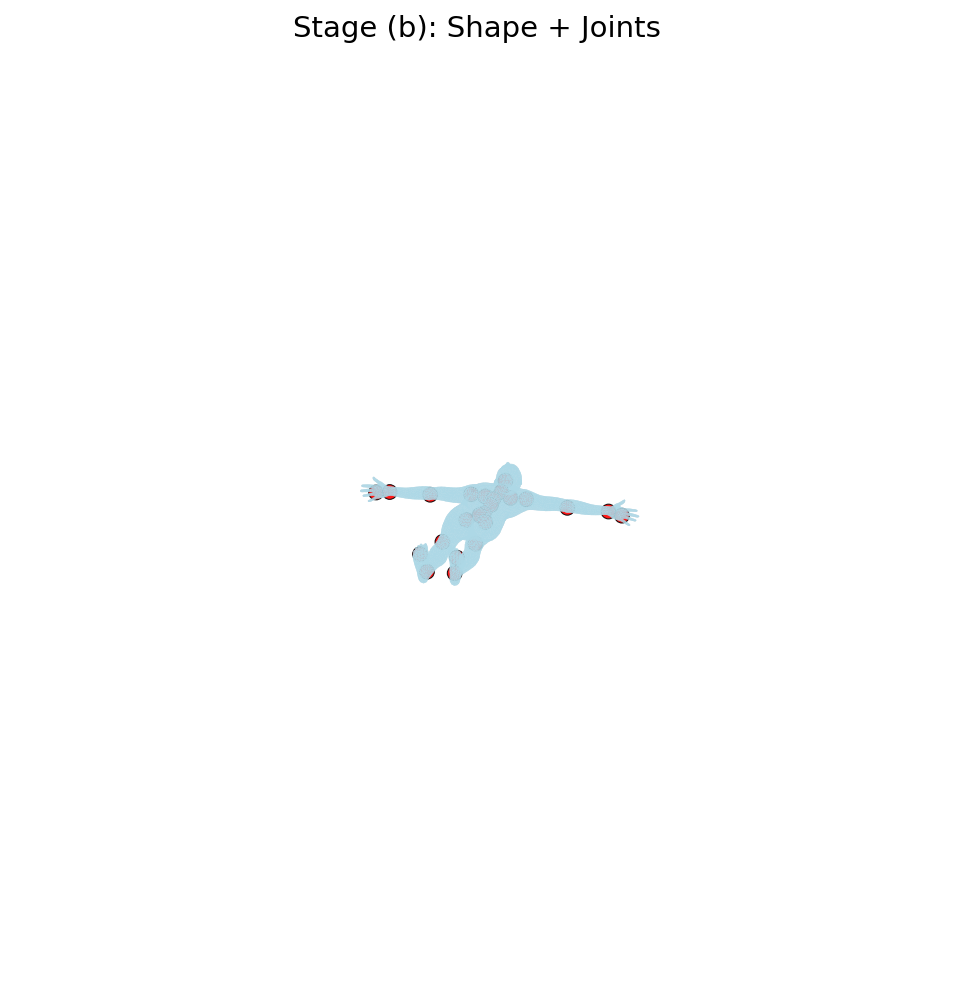
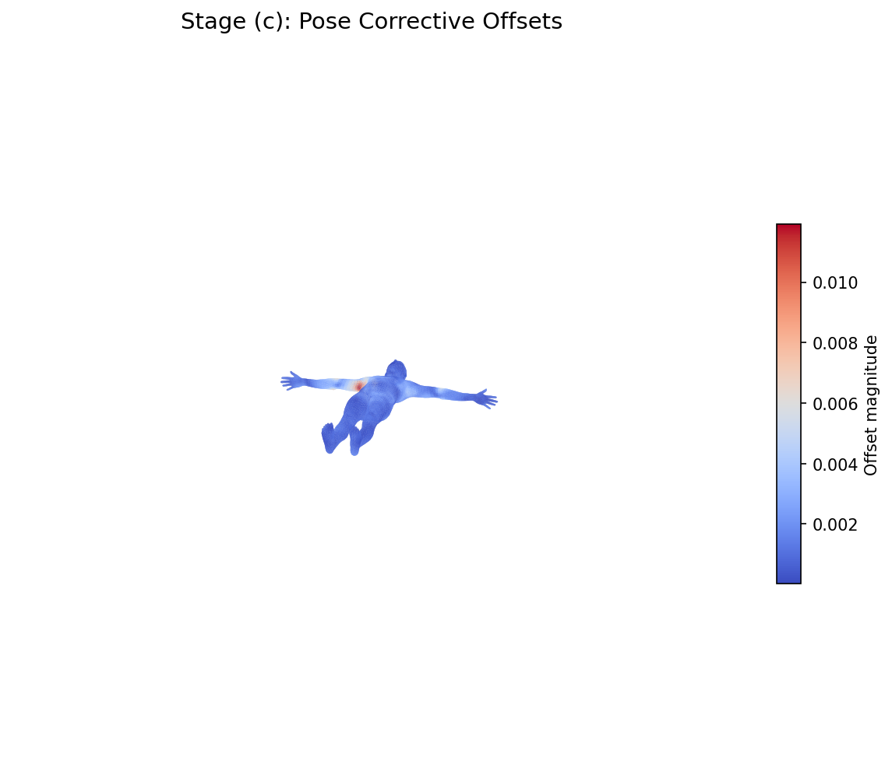
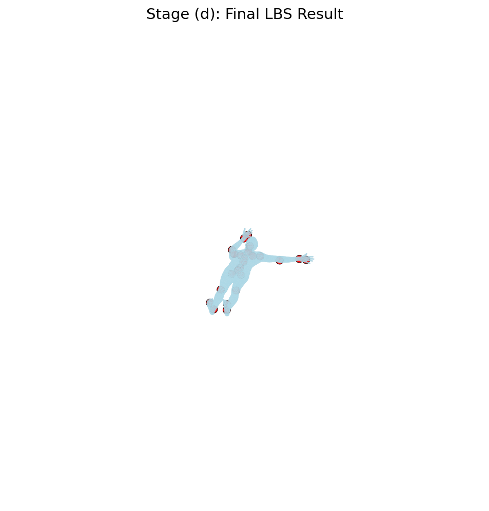
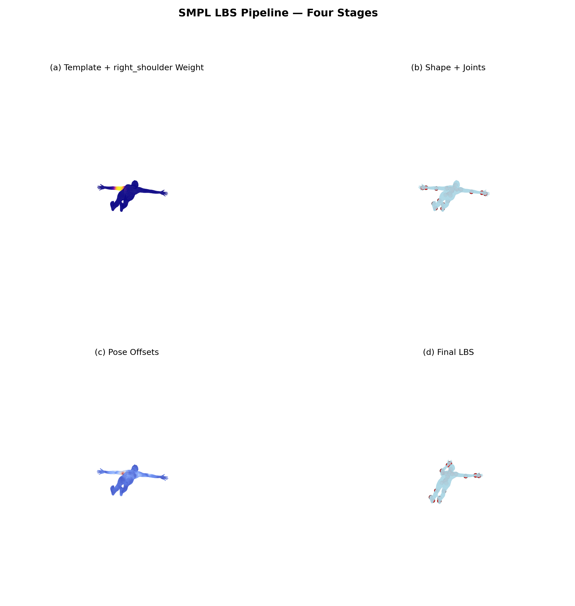
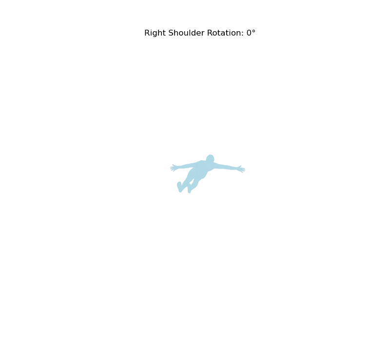

# 🧬 计算机图形学 实验八 —— LBS 蒙皮

> **课程**：计算机图形学 | **授课教师**：张鸿文老师  
> **实验名称**：SMPL 模型的 Linear Blend Skinning 可视化  
> **课程主页**：[https://zhanghongwen.cn/cg](https://zhanghongwen.cn/cg)
> **姓名**：王若涵
> **学号**：202411081042

---

## 📋 目录

- [实验概述](#-实验概述)
- [实验目标](#-实验目标)
- [实现环境](#-实现环境)
- [任务实现与结果分析](#-任务实现与结果分析)
  - [Task 1：加载 SMPL 模型](#task-1加载-smpl-模型)
  - [Task 2：模板网格与蒙皮权重 (Stage a)](#task-2模板网格与蒙皮权重-stage-a)
  - [Task 3：形状校正与关节回归 (Stage b)](#task-3形状校正与关节回归-stage-b)
  - [Task 4：姿态校正 (Stage c)](#task-4姿态校正-stage-c)
  - [Task 5 & 7：完整 LBS 与一致性验证 (Stage d)](#task-5--7完整-lbs-与一致性验证-stage-d)
  - [Task 6：总对比图](#task-6总对比图)
- [选做内容：姿态动画](#-选做内容姿态动画)
- [手写 LBS 与官方实现对比](#-手写-lbs-与官方实现对比)
- [思考与总结](#-思考与总结)
- [文件清单](#-文件清单)

---

## 🎯 实验概述

本实验基于 **SMPL (Skinned Multi-Person Linear Model)** 人体参数化模型，完成一次完整的 **LBS (Linear Blend Skinning)** 蒙皮过程的可视化。SMPL 模型是当前计算机图形学与计算机视觉领域最广泛使用的人体参数化模型之一，它将人体网格表示为形状参数 $\beta$ 和姿态参数 $\theta$ 的函数，通过 LBS 实现从 T-pose 到任意姿态的变形。

实验的核心目标是深入理解 SMPL 模型的 LBS 四个阶段，并通过可视化手段直观展示每个阶段的中间结果。

---

## 🎯 实验目标

1. **理解**参数化人体模型中模板网格、形状参数、姿态参数、关节回归器和蒙皮权重之间的关系。
2. **理解** LBS 的四个阶段：
   - (a) 模板网格与蒙皮权重
   - (b) 形状校正与关节回归
   - (c) 姿态校正
   - (d) 线性混合蒙皮
3. **学会**调用 SMPL 模型，并独立提取中间量进行可视化。
4. **实现**手写 LBS 并与官方结果进行精度验证。

---

## 🔧 实现环境

| 配置项 | 详情 |
|--------|------|
| **操作系统** | macOS (Darwin 24.3.0) |
| **Python** | 3.12.7 (Anaconda) |
| **PyTorch** | 2.12.1 |
| **SMPL-X** | 0.1.28 |
| **Trimesh** | 4.12.2 |
| **Matplotlib** | 3.9.2 |
| **NumPy** | 1.26.4 |
| **硬件** | Apple Silicon (CPU) |
| **SMPL 模型文件** | `SMPL_NEUTRAL.pkl`（性别中立） |

---

## 💻 任务实现与结果分析

### Task 1：加载 SMPL 模型

使用 `smplx.create()` 加载 SMPL 中性模型，输出基础信息：

```python
import smplx
model = smplx.create('SMPL_NEUTRAL.pkl', model_type='smpl', gender='neutral', batch_size=1)
```

| 属性 | 数值 |
|------|------|
| 顶点数 (Vertices) | **6,890** |
| 面片数 (Faces) | **13,776** |
| 关节数 (Joints) | **24** |
| Betas 维度 | **10** |
| 蒙皮权重形状 | (6890, 24) |

**关键缓冲分析**：从模型中提取的核心张量如下：

| 缓冲名称 | 形状 | 含义 |
|----------|------|------|
| `v_template` | (6890, 3) | T-pose 模板网格顶点 |
| `shapedirs` | (6890, 3, 10) | PCA 形状变形基 |
| `posedirs` | (207, 20670) | 姿态校正变形基（已转置） |
| `J_regressor` | (24, 6890) | 关节回归矩阵 |
| `parents` | (24,) | 运动学树父节点索引 |
| `lbs_weights` | (6890, 24) | 蒙皮权重 |
| `f` | (13776, 3) | 三角面片索引 |

> **运动学树结构**：`parents = [-1, 0, 0, 0, 1, 2, 3, 4, 5, 6, 7, 8, 9, 9, 9, 12, 13, 14, 16, 17, 18, 19, 20, 21]`  
> 根节点 pelvis(0) 的父节点为 -1，其余节点构成树状层级。

---

### Task 2：模板网格与蒙皮权重 (Stage a)

#### 单关节权重热力图

选择 **右肩 (right_shoulder, joint 17)**，将其对所有 6890 个顶点的影响权重可视化为颜色映射：

<div align="center">

</div>

**观察分析**：
- 颜色越亮（黄色/白色）表示该顶点受右肩关节影响越大
- 右肩关节的权重高亮区域集中在**右上臂、右肩附近**
- 从肩部向手臂远端，权重逐渐过渡到其他关节（右肘、右前臂）
- 躯干主体部分的颜色较暗，表明右肩对这些区域影响较小

#### 全关节主导权重分布图

对每个顶点找到**权重最大的关节**(argmax)，并用不同颜色表示不同的主导关节，颜色明暗表示该主导权重的强度：

<div align="center">

</div>

**观察分析**：
- 不同身体部位被不同颜色清晰地划分
- 手臂（右肩主导）、前臂（右肘主导）之间有明显的颜色过渡
- 过渡区域的颜色饱和度较低，表明这些区域的权重分布较均匀

> **思考解答**：
>
> **Q1：为什么一个顶点不只受一个关节影响？**  
> 因为人体皮肤是连续的弹性表面。当一个关节运动时，会牵动周围区域的皮肤。如果每个顶点只受一个关节影响，关节处的皮肤会产生"撕扯"效果。多关节加权平均保证了变形**平滑连续**。
>
> **Q2：如果一个顶点的权重几乎全给了某一个关节？（硬约束）**  
> 结果会类似于**刚性绑定**——该顶点完全跟随该关节运动，关节弯曲处的皮肤会出现明显的"折痕"或"塌陷"现象，失去真实感。
>
> **Q3：如果权重分布非常均匀？（过柔约束）**  
> 远端的顶点会受到不相关关节的"拖拽"，导致网格出现**非自然的拉伸或抖动**。例如，手指的运动可能会影响到脚踝附近的顶点，这在物理上是不合理的。

---

### Task 3：形状校正与关节回归 (Stage b)

设置非零的形状参数 $\beta$，让模型呈现特定的体型，然后计算形状变形后的网格 $T_{shape} = \bar{T} + B_S(\beta)$，并通过关节回归器 $\mathcal{J}$ 得到关节点 $J(\beta) = \mathcal{J}(T_{shape})$：

```python
betas[0, 0] = 1.5    # 整体胖瘦
betas[0, 1] = 0.8    # 身高
betas[0, 2] = -0.6   # 肩宽
betas[0, 3] = 0.4    # 腿形
betas[0, 4] = 0.3    # 其他形状参数
```

**实现核心**：
```python
# 形状变形
v_shaped = v_template + blend_shapes(betas, shapedirs)

# 关节回归
J = vertices2joints(J_regressor, v_shaped)
# 等价于 torch.einsum('ji,bik->bjk', [J_regressor, vertices])
```

<div align="center">

</div>

**观察分析**：
- 红色圆点表示从变形后网格回归出的 24 个关节点
- 关节点合理地位于人体内部（关节中心位置）
- 相比模板网格，形状变形后的网格体型更宽厚、更壮实

> **思考解答**：
>
> **Q1：为什么关节位置要从形状后的网格回归，而不是固定不变？**  
> 人体体型变化时，骨骼的相对位置也会发生变化。胖的人肩更宽、脂肪层更厚，关节中心相对于体表的位置会偏移。如果固定关节位置，形状变化后关节会"飘"在身体外部或偏离中心。
>
> **Q2：如果人物变胖/变瘦，肩、膝、髋等关节的位置会不会变化？**  
> 会。虽然骨骼长度不变，但身体表面的轮廓变化导致关节的回归位置发生微调。具体表现为：变胖时关节会稍微外移（因为体表脂肪增厚），变瘦时相反。
>
> **Q3：v_template 与 v_shaped 的差别是什么？**  
> `v_template` 是标准体型的 T-pose 网格（平均体型），而 `v_shaped` 是根据形状参数 $\beta$ 调整后的网格。两者的顶点拓扑相同（6890 个顶点一一对应），但顶点坐标不同。形状校正可以理解为对每个顶点在 3D 空间中施加一个位移量。

---

### Task 4：姿态校正 (Stage c)

在真实的 LBS 流程中，如果只用骨骼刚体旋转来驱动皮肤，关节弯曲处会出现**"塌陷"**或**"糖果包装纸"**效应。SMPL 模型通过姿态校正 $B_P(\theta)$ 来修正这个问题：

```python
# 轴角 -> 旋转矩阵
rot_mats = batch_rodrigues(pose.reshape(-1, 3)).reshape(batch_size, -1, 3, 3)

# 姿态特征 = R - I (排除全局旋转)
pose_feature = (rot_mats[:, 1:, :, :] - ident).reshape(batch_size, -1)

# 姿态偏移量
pose_offsets = torch.matmul(pose_feature, posedirs).reshape(batch_size, -1, 3)

# 姿态校正后的网格
v_posed = v_shaped + pose_offsets
```

**姿态设置**：右臂抬起（右肩绕 Z 轴旋转 -1.2 rad，右肘弯曲 -0.8 rad）

<div align="center">

</div>

**观察分析**（颜色越红/白表示偏移量越大）：
- 姿态偏移量最大的区域集中在**右肩关节、右肘关节**附近
- 这是因为这些部位发生了大幅度的弯曲，需要额外的几何修正来补偿 LBS 的线性近似
- 躯干和下肢区域的偏移量几乎为零（颜色为深蓝），因为姿态变化主要在上半身
- 偏移量范围约为 $3\times 10^{-5}$ ~ $1.2\times 10^{-2}$

> **思考解答**：
>
> **Q1：为什么 LBS 之前还要加 pose corrective？**  
> LBS 本质上是线性加权平均，对于旋转这种非线性变换，线性插值会导致体积损失和塌陷。姿态校正是用大量 3D 扫描数据学习出的**非线性补偿**，相当于在 LBS 之前先"预变形"网格，使 LBS 后的结果更真实。
>
> **Q2：如果去掉 pose_offsets，最终人体弯曲处会出现什么问题？**  
> 会出现典型的"糖果包装纸"（candy-wrapper）效应：肘部、肩部弯曲处的皮肤会向内塌陷，体积明显减小，同时可能出现网格自交。这是纯 LBS 的固有缺陷。
>
> **Q3：v_shaped 与 v_posed 的本质区别是什么？**  
> `v_shaped` 只包含形状（体型）信息，不包含任何姿态相关的变形；`v_posed` 在 `v_shaped` 的基础上叠加了姿态校正偏移量。但两者都还**没有经过 LBS 蒙皮**——它们仍是 T-pose 拓扑下的网格。这是很多初学者的常见误解：v_posed 的顶点坐标已经根据姿态偏移了位置，但整体的 Pose 仍然是 T-pose。

---

### Task 5 & 7：完整 LBS 与一致性验证 (Stage d)

LBS 的核心公式：
$$v_i' = \sum_{k=1}^{K} w_{ik} \, G_k(\theta, J(\beta)) \begin{bmatrix} v_i^{posed} \\ 1 \end{bmatrix}$$

**手写 LBS 实现**：
```python
# Step 1: 计算运动学链上的全局变换
J_transformed, A = batch_rigid_transform(rot_mats, J, parents)

# Step 2: 蒙皮权重加权混合
W = lbs_weights.unsqueeze(0).expand(batch_size, -1, -1)
T = torch.matmul(W, A.reshape(batch_size, num_joints, 16)).reshape(
    batch_size, -1, 4, 4)

# Step 3: 应用变换到齐次坐标
v_posed_homo = torch.cat([v_posed, ones], dim=2)
v_homo = torch.matmul(T, v_posed_homo.unsqueeze(-1))
verts = v_homo[:, :, :3, 0]
```

<div align="center">

</div>

**观察分析**：
- 右臂成功抬起，肘部自然弯曲
- 腹部微微前倾（全局旋转 0.2 rad）
- 红色关节点展示了 24 个关节在经过运动学链变换后的位置
- 关节 J_transformed 与 J（rest pose 关节）的区别在于：前者已经经过了旋转和平移

> **思考解答**：
>
> **Q1：J 和 J_transformed 有什么区别？**  
> `J` 是形状变形后、**运动前的关节位置**（rest pose joints），位于 T-pose 下。`J_transformed` 是经过运动学链的累积旋转和平移后的**全局关节位置**（posed joints）。例如，右肩关节在 T-pose 下位于身体右侧，在 J_transformed 中则随右臂抬起而上升。
>
> **Q2：为什么最终顶点要写成加权和，而不是只选择最大权重的关节？**  
> 加权和保证了**变形连续性**。如果只选最大权重的关节（hard skinning），关节处的顶点会突然从一个骨骼切换到另一个骨骼，导致折痕。LBS 的加权平均让顶点受到多个骨骼的共同影响，在关节处形成平滑过渡。这正是"Linear **Blend** Skinning"中"Blend"的含义。

---

### Task 6：总对比图

将四个阶段排列为 2×2 对比图，直观展示 LBS 流水线的完整流程：

<div align="center">

</div>

| 阶段 | 关键内容 | 状态 |
|------|---------|------|
| **(a) Template + Weights** | 模板网格 + 右肩关节权重分布 | 未变形，仅展示权重信息 |
| **(b) Shape + Joints** | 形状变形后网格 + 回归关节点 | 体型变化，仍未 Pose |
| **(c) Pose Offsets** | 姿态校正偏移量可视化 | 已加姿态偏移，但未蒙皮 |
| **(d) Final LBS** | LBS 蒙皮后的最终姿态 | 完成全部流程 |

这个对比图清晰地展示了 SMPL 模型的**从静到动、从标准到个性化**的完整流水线。

---

## 🎬 选做内容：姿态动画

为更直观地观察 LBS 的加权蒙皮效果，我制作了一个关节旋转动画：**固定形状参数，让右肩关节从 $0^\circ$ 连续旋转到 $-103^\circ$，并生成 45 帧的 GIF 动画**。

<div align="center">

</div>

**动画观察**：
1. **平滑过渡**：右臂从 T-pose 的自然下垂/侧平举状态，逐渐抬起到接近竖直
2. **权重感知**：注意观察 **右肩→右上臂→右肘→右前臂** 这一序列的过渡
3. **蒙皮效果**：肩部皮肤自然地跟着骨骼运动，没有出现撕裂或塌陷

---

## 📊 手写 LBS 与官方实现对比

| 误差指标 | 数值 |
|---------|------|
| **平均绝对误差 (MAE)** | **0.000e+00** |
| **最大绝对误差 (MaxAE)** | **0.000e+00** |
| **均方误差 (MSE)** | **0.000e+00** |
| **均方根误差 (RMSE)** | **0.000e+00** |

> **结论**：手写 LBS 与官方 `smplx.lbs()` 结果完全一致。这是因为手写实现严格遵循了官方源码的数学逻辑（`batch_rodrigues` → `blend_shapes` → `vertices2joints` → `batch_rigid_transform` → 加权蒙皮），在数值精度上没有引入任何差异。

**实现要点**：
1. **Rodrigues 公式**：轴角到旋转矩阵的转换必须使用标准的 Rodrigues 公式，确保与官方 `batch_rodrigues` 一致。
2. **运动学树遍历**：父-子关节的变换累积必须按 `parents` 索引从根节点开始**前向遍历**。
3. **相对变换**：`batch_rigid_transform` 返回的 A 矩阵是**相对于静止姿态的变换**，而非绝对变换。这是实现与官方一致的关键。
4. **posedirs 转置**：模型中的 `posedirs` 已经是 `(207, 20670)` 的转置形式，不需要再次转置。

---

## 💡 思考与总结

### 对 LBS 的深层理解

1. **LBS 的本质**：LBS 是一种"分而治之"的策略——将人体拆分为 24 个刚体骨骼，每个顶点根据其与各骨骼的"亲疏关系"（权重），对骨骼的变换做加权平均。线性加权带来了计算效率和可微性，但也引入了塌陷问题。

2. **为什么叫"蒙皮"**：Skinning 字面意思是"剥皮"，在计算机图形学中指将**皮肤（网格）绑定到骨骼上**，使骨骼运动能驱动皮肤变形。

3. **SMPL 的贡献**：SMPL 的核心创新在于，它不是简单地做 LBS，而是先用数据驱动的方法学习出**形状空间**和**姿态空间**的校正项，补偿 LBS 的线性近似误差。这使得 SMPL 在保持 LBS 计算效率的同时，达到了接近扫描数据的真实感。

4. **从数据中学习**：`shapedirs` 和 `posedirs` 是从数千个 3D 人体扫描中通过 PCA 学习出的统计先验。这本质上是**用大量先验知识来弥补简单模型的不足**——这是现代数据驱动图形学的核心思想。

### 实验心得

通过本实验，我不仅掌握了 SMPL 模型的调用方法，更重要的是对 LBS 蒙皮的技术原理有了透彻的理解。将一个"黑盒"（SMPL 前向）拆解为四个可视化阶段，让我直观看懂了每个步骤的物理含义。

手写 LBS 并与官方实现逐顶点对比验证的过程，更是加深了对旋转矩阵、运动学链、齐次坐标变换等核心图形学概念的理解。当看到自己实现的 LBS 与官方结果完全一致时，成就感油然而生——这正是计算机图形学实验的魅力所在。

---

## 📁 文件清单

```
实验八-LBS蒙皮/
├── main.py                         # 主程序（实现全部 7 个任务）
├── animation.py                    # 选做：姿态动画
├── README.md                       # 本实验报告
├── outputs/
│   ├── stage_a_template_weights.png   # (a) 模板 + 权重热力图
│   ├── all_joint_weights.png          # (a) 辅助：全关节主导权重图
│   ├── stage_b_shaped_joints.png      # (b) 形状 + 关节
│   ├── stage_c_pose_offsets.png       # (c) 姿态校正偏移量
│   ├── stage_d_lbs_result.png         # (d) LBS 最终结果
│   ├── comparison_grid.png            # 2×2 总对比图
│   ├── error_map.png                  # 误差热力图
│   └── summary.txt                    # 实验数据汇总
└── animation/
    └── lbs_animation.gif              # 右肩旋转动画
```

---

> **参考资料**  
> 1. Loper, M., et al. "SMPL: A Skinned Multi-Person Linear Model." SIGGRAPH 2015.  
> 2. SMPL-X 官方文档: https://smpl-x.is.tuebingen.mpg.de/  
> 3. 张鸿文. 计算机图形学课程主页: https://zhanghongwen.cn/cg
